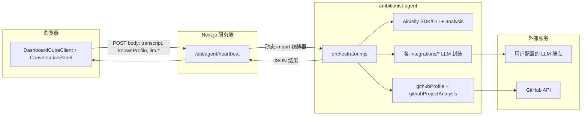

# Ambitionist（野心家）— 项目总览

本仓库是黑客松场景下的**长周期毕业与职业决策引擎**：面向计算机专业学生，在「面试式对话 → 结构化档案 → 外部证据 → 市场/路径语境 → 规划与比较」的闭环中工作。与一次性聊天机器人不同，系统会**主动追问缺失变量**、把对话与 GitHub / AirJelly 证据沉淀为**可持久化的档案与简历式快照**，并在适当时机给出**可解释的下一步建议**。

**重要设计现状（与早期纯规则版不同）：**

- **大模型（OpenAI 兼容 API）** 承担用户可见的总结、下一问、市场语境、职业规划与比较文案等；规则与静态技能主要作为**数据合并、兜底结构或 CLI 演示**。
- **API Key、Base URL、Model、Wire API** 由**前端页面输入**，经 `/api/agent/heartbeat` 传入 Agent；`ambitionist-agent` 内 **不从环境变量读取 LLM Key**（避免误提交密钥；本地 `.env` 中若存在 `AMBITIONIST_LLM_*` 也不会被当前主流程使用）。
- **首轮问题固定**为自我介绍（姓名/学校/毕业年/GitHub 等），不由 LLM 生成首句，保证冷启动一致。
- **档案完整度 &lt; 50%** 时，规划模块对「未来路线图 / 具体 next actions」的生成受约束，仅作试探性建议并追问信息。

---

## 仓库结构

```text
黑客松/
├── README.md                 # 本文件：流程、文件职责、设计说明
├── frontend/                 # Next.js 16 应用（App Router）
│   ├── app/                  # 页面、组件、API 路由、前端映射逻辑
│   └── package.json
└── ambitionist-agent/        # Node（ESM）决策引擎
    ├── src/
    │   ├── orchestrator.mjs  # 心跳循环与技能编排
    │   ├── index.mjs         # CLI 入口（读 JSON 跑一轮）
    │   ├── types.mjs
    │   ├── skills/           # 规则向技能（ interview / profile / market / path ）
    │   ├── integrations/     # LLM、GitHub、AirJelly
    │   ├── storage/          # JSON 档案落盘
    │   ├── contracts/        # 市场数据Provider 接口
    │   ├── data/             # 市场静态快照等
    │   └── utils/
    ├── data/profiles/        # 启用了 storage 时的示例/演示数据
    ├── examples/             # 命令行用输入 JSON
    └── docs/TECHNICAL_ROUTE.md
```

Web 与 CLI **共用同一套** `AmbitionistOrchestrator.runHeartbeatCycle`；仅入口与是否携带浏览器里填的 `llm` 不同。

---

## 端到端流程（主路径：网站）



1. 用户在 **`/dashboard` 或 `/cube`** 打开与 **`DashboardCubeClient`** 绑定的页面（两路由均挂载同一客户端）。
2. 用户在 **`ConversationPanel`** 填写 **LLM Key、Base URL、Model、Wire API**；可选是否启用 AirJelly 等（由 `requestAgent` 组请求体）。
3. **`/api/agent/heartbeat`** 解析 body，用 `buildAgentInput` 组装 `input`（`llm.enabled` 以是否提供 Key 为准），**动态 `import` 本机 `ambitionist-agent/src/orchestrator.mjs`** 并执行 `runHeartbeatCycle`。
4. 返回的 JSON 经 **`app/lib/agentDashboard.ts`** 映射为 `dashboard` 展示结构（六边形卡片、计划板、市场更新等），避免 UI 直接绑死 agent 内部字段名。

**说明：** LLM 的 HTTP 请求在 **Next 服务端** 发出（用户配置的 URL），不是浏览器直连；因此若填 `http://127.0.0.1:...`，需要本机已监听该兼容服务。

---

## 编排器 `runHeartbeatCycle` 内部顺序（简版）

以下与 `orchestrator.mjs` 实际顺序一致，便于对照代码阅读。

| 阶段 | 行为 |
|------|------|
| 初始化 | 合并 `transcript`、计算 `askedQuestionIds`、克隆 `knownProfile` |
| AirJelly | `collectAirJellySignals`：先 `checkAirJellyCliStatus`，再 SDK，失败再 CLI；聚合 `taskQueue`（按 `l1_scene` 等分组的开放任务等） |
| 面试步 | `runInterviewStep`：无对话且无语句答案时，直接返回**固定**首问；否则优先 **`generateInterviewStateWithLlm`**，失败再落到 **`DeepInterviewSkill` 兜底** + **`extractProfileSignalsWithLlm`** |
| GitHub | 解析用户名后 `fetchGithubProfileEvidence`；`enrichGithubReposWithContentAnalysis` 可按 LLM 做仓库内容级分析 |
| 档案 | `ProfileUpdateSkill.update`（规则）与 **`generateProfileUpdateWithLlm`** 二选一，**优先 LLM 结果** |
| 展示层 | **`generateProfilePresentationWithLlm`** 生成/润色 `profileSummary`、`resumeSnapshot` 等 |
| 是否进入规划 | 由 `shouldAdviseNow` 综合：轮次、是否「规划类」关键词、完整度与定时刷新等；否则返回 **`needs_interview`** 与下一问；下一问可经 **`generateInterviewQuestionWithLlm`** 改写 |
| 规划 | **`generateMarketContextWithLlm`** → **`generateCareerPlanWithLlm`**（含完整度门槛对 roadmap/nextActions 的约束）；`persistIfEnabled` 内 **`selectConversationHighlightsWithLlm`** 做存盘高亮筛选 |

`state.phase` 在代码中会经过 `interviewing` → `market_searching` → `comparing` → `done` 等标签式推进，与对外 `status: needs_interview | ready` 配合使用。

---

## 各目录与关键文件作用

### `frontend/`

| 路径 | 作用 |
|------|------|
| `app/page.tsx` | 落地页，挂载 `LandingPageClient` |
| `app/cube/page.tsx` | `/cube`：主产品立方体看板，挂载 `DashboardCubeClient` |
| `app/dashboard/page.tsx` | `/dashboard`：同上（与 `/cube` 复用同一客户端） |
| `app/DashboardCubeClient.tsx` | **主状态机**：消息列表、`transcript`、调 `/api/agent/heartbeat`、`applyAgentResult`、首问/重新生成、LLM 表单状态 |
| `app/DashboardClient.tsx` | 旧版/简化看板；展示用，LLM 相关 props 为占位，**主流程请以 `DashboardCubeClient` 为准** |
| `app/LandingPageClient.tsx` | 落地页交互 |
| `app/components/ConversationPanel.tsx` | 对话区、**API 设置**（Key / Base URL / Model / Wire API）、发送 |
| `app/components/ChatPanel.tsx` | 聊天展示子组件（若被引用） |
| `app/components/CubeContainer.tsx`、`*Card.tsx`、`*Panel.tsx`、`*Board.tsx` 等 | 立方体面片、档案卡、市场更新、计划板、对比卡等纯 UI |
| `app/lib/agentDashboard.ts` | **Agent JSON → 前端 `dashboard` 领域模型**；`buildAssistantSummary`、`map*`，避免预置套话、优先 LLM 字段 |
| `app/data/mockData.ts` | 空/占位初始数据，避免演示假人设污染 |
| `app/api/agent/heartbeat/route.ts` | **桥接层**：`AMBITIONIST_AGENT_ROOT` 定位 agent、组装 `input`、调用 `runHeartbeatCycle` |

### `ambitionist-agent/src/`

| 路径 | 作用 |
|------|------|
| `orchestrator.mjs` | 主编排：`FIRST_ONBOARDING_QUESTION`、`runInterviewStep`、`runHeartbeatCycle`、`collectAirJellySignals`、`persistIfEnabled` |
| `index.mjs` | CLI：读 `examples/*.json` 调 `runHeartbeatCycle` 并打印 |
| `types.mjs` | 默认 profile 状态、`cloneProfile` 等 |
| `integrations/llmClient.mjs` | **统一 LLM 出口**：`callJsonLlm` / `isLlmConfigured`；仅使用传入的 `options`（`apiKey/baseUrl/model/wireApi`） |
| `integrations/llmDecisionSupport.mjs` | 信号抽取、会话高亮筛选、**下一问**生成（与 `DeepInterview` 的候选问配合） |
| `integrations/profileStateSupport.mjs` | **面试状态**（完整度、下一问、板子）与 **LLM 档案更新** |
| `integrations/profilePresentationSupport.mjs` | 面向展示的 summary / 简历快照等 |
| `integrations/marketDecisionSupport.mjs` | 市场语境、候选路径、`searchMemory` 等（供规划与 UI） |
| `integrations/planningDecisionSupport.mjs` | 职业规划、比较结构、`conversationalReply`、`followUpQuestion`；**受 profileCompleteness 约束** |
| `integrations/githubProfile.mjs` | GitHub 用户/仓库元数据；可选 `GITHUB_TOKEN` 提高限额 |
| `integrations/githubProjectAnalysis.mjs` | 按仓库做 LLM 向的内容分析（受 `llm` 与开关控制） |
| `integrations/airjellySdk.mjs` / `airjellyCli.mjs` | AirJelly 数据拉取；启动时 **status、开放任务、任务详情与 memories** 等 |
| `integrations/airjellyAnalysis.mjs` | 归一化输出、`taskQueue`（`byScene` 等）供编排与提示词 |
| `skills/deepInterviewSkill.mjs` | **非生成式兜底**：在 LLM 未返回有效面试状态时使用占位/空结构，**不再作为用户可见主输出源** |
| `skills/profileUpdateSkill.mjs` | 规则向档案合并、矛盾检测等；在 LLM 未启用或失败时兜底 |
| `skills/marketSearchSkill.mjs` / `pathCompareSkill.mjs` | 基于静态 `trendSnapshots` 与**显式维度的**规则比较；**主 Web 流在 LLM 可用时以 `marketDecisionSupport` + `planningDecisionSupport` 的产出为准**，两技能仍可用于 CLI、扩展或回退 |
| `contracts/marketDataProvider.mjs` | 市场数据抽象；`StaticSnapshotMarketProvider` |
| `storage/profileRepository.mjs` | 将一次心跳结果写入 JSON 文件（需 `storage.enabled`） |
| `data/trendSnapshots.mjs` | 市场与路径的演示用静态数据 |
| `utils/format.mjs` / `scoring.mjs` | CLI 输出格式与通用打分工具 |

### `ambitionist-agent/examples/`

- `onboarding-empty.json`：冷启动。
- `hkust-case.json`、`market-ready-case.json` 等：较满的 profile / 场景，供 CLI 或调试。

### `ambitionist-agent/docs/TECHNICAL_ROUTE.md`

- 更长的**技术路线与叙事板**（对话板 / 档案板 / 市场板），可与本 README 对照阅读。

---

## 设计要点摘要

1. **安全与可移植**：仓库内不依赖提交 LLM Key；由用户在 UI 填写，经单次请求体传入。
2. **LLM 与规则分工**：用户可见的文案、问题与规划**优先**走 `callJsonLlm`；规则技能保证无 Key 或超时时**仍有结构**可展示或落盘。
3. **首问固定**：降低冷启动方差，并强制先收集身份与 GitHub。
4. **AirJelly**：增强记忆与任务语境；**非** ChatGPT API，但与 LLM 提示词中的 `airjellyTaskQueue` 等字段结合。
5. **GitHub**：公开 API 拉元数据；分析深度受 `githubAnalysis` 与 LLM 开关影响；`GITHUB_TOKEN` 仅服务 GitHub 端，不替代 LLM Key。
6. **前端映射层**：`agentDashboard.ts` 集中做字段映射与摘要拼接，减少组件内散落假数据。

---

## 请求与响应（Heartbeat）要点

`POST /api/agent/heartbeat` 的 body 在类型上可包含（节选）：

- `userId`、`userMessage`
- `knownProfile`
- `transcript`：含 `questionId`、`question`、`answer` 等
- `llm`：`apiKey`、`baseUrl`、`model`、`wireApi`（`chat_completions` 或 `responses`）
- `airjelly`、`githubAnalysis`、`planning`、`storage` 等（与 `buildAgentInput` 一致）

服务端用 **`AMBITIONIST_AGENT_ROOT`**（默认相对 `../ambitionist-agent`）解析编排器路径。

返回中常见：

- `status: needs_interview`：继续访谈，带 `nextQuestion`、`interviewBoard`、`profile` 等
- `status: ready`：进入规划型输出，带 `comparison`、`marketContext`/`marketLandscape`、`followUpQuestion` 等

详细字段以 `orchestrator.mjs` 返回对象与 `agentDashboard.ts` 的 `AgentApiResult` 为准。

---

## 本地运行

### 仅 Agent（CLI）

需 **Node ≥ 22**。

```bash
cd ambitionist-agent
node ./src/index.mjs demo ./examples/hkust-case.json
# 或 plan / interview / profile，见 package.json scripts
```

**注意**：示例 JSON 若无 `llm.apiKey` 等，则与浏览器行为一致，LLM 相关能力会关闭或走兜底文案。

### Web 前端

```bash
cd frontend
npm install
npm run dev
```

浏览器访问 **`/dashboard` 或 `/cube`**，在 **API 设置** 中填写 Key 与（如需）Orbit/自建网关的 **Base URL**、**Model**、**Wire API**。

### 仅开发用的环境变量

| 变量 | 用途 |
|------|------|
| `AMBITIONIST_AGENT_ROOT` | 若 agent 不在默认相对路径，在 Next 侧指向其根目录 |
| `GITHUB_TOKEN` | **可选**；在 agent 拉 GitHub 时使用，提高 rate limit，**不是** OpenAI Key |

`frontend/.env.local` 可存在历史字段名，**当前主流程不读取其中的 LLM 变量作为默认 Key**；以页面输入为准。

---

## 扩展与维护建议

- **接入真实市场爬虫**：实现 `MarketDataProvider` 新实现，并决定是否在 `generateMarketContextWithLlm` 的提示中引用或替换静态语境。
- **强规则可解释比较**：`pathCompareSkill` 仍可作为「评委可见」的显式维度的参考或与 LLM 结果对照。
- **AirJelly**：保持 SDK/CLI 与健康检查，新增 API 时优先在 `airjellyAnalysis` 归一化后再进编排器。

---

## 版本说明

本 README 描述的是**当前**仓库中「Next 前端 + ESM 编排器 + LLM 集成 + AirJelly/GitHub」联调形态；若你修改了编排顺序或 `heartbeat` 契约，请同步更新本文与 `ambitionist-agent/docs/TECHNICAL_ROUTE.md`。
